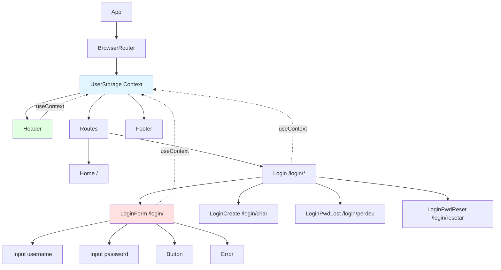
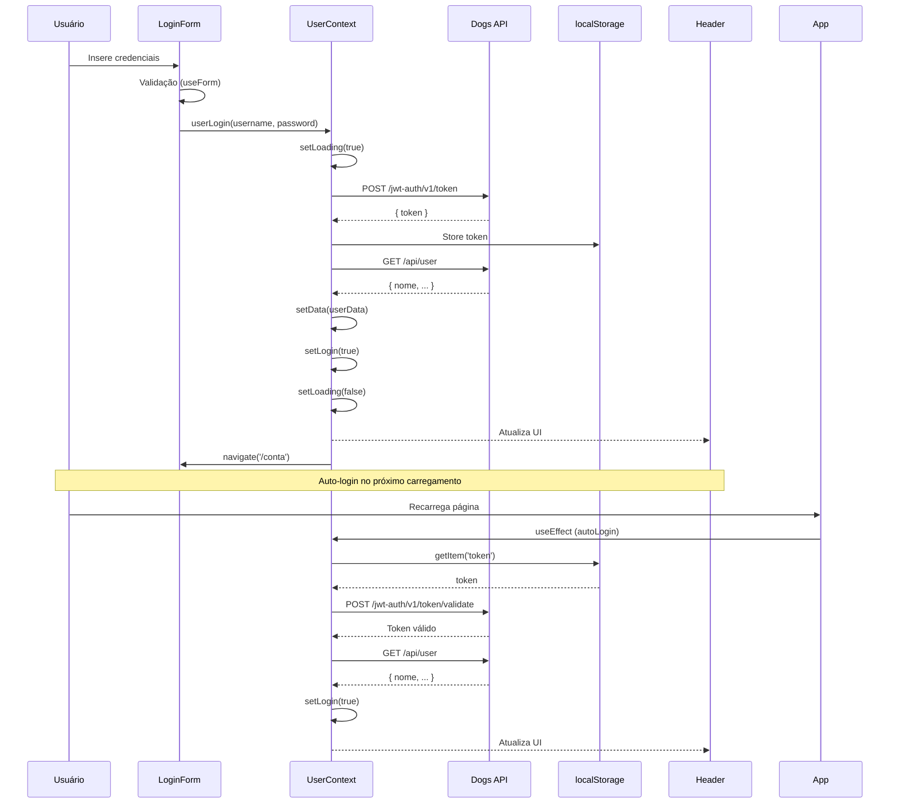
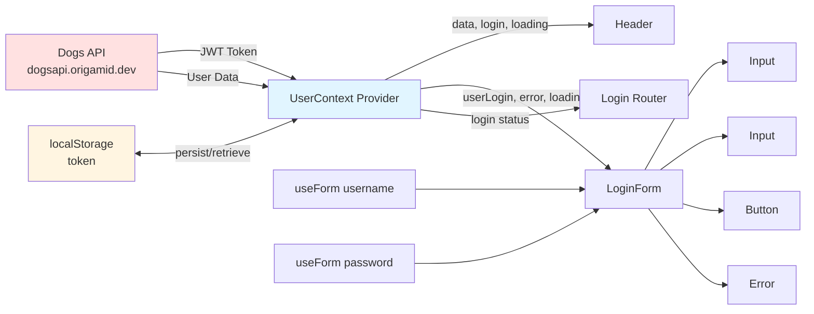

# Dogs Social

> Uma rede social moderna para amantes de cachorros, construída com React e Vite

## Sobre o Projeto

**Dogs Social** é uma aplicação web de rede social dedicada a compartilhar fotos e momentos de cachorros. O projeto utiliza tecnologias modernas do ecossistema React para criar uma experiência de usuário fluida e responsiva.

### Status Atual

O projeto está em desenvolvimento ativo com o sistema de autenticação completamente funcional. Recursos sociais como feed, criação de posts e interações estão planejados para implementação futura.

### Funcionalidades Implementadas

- ✅ Sistema de autenticação JWT completo
- ✅ Login de usuários com validação de formulários
- ✅ Persistência de sessão (localStorage)
- ✅ Auto-login ao recarregar a página
- ✅ Logout seguro
- ✅ Navegação dinâmica baseada em estado de autenticação
- ✅ Componentes reutilizáveis de formulário (Input, Button)
- ✅ Gerenciamento de estado global com Context API
- ✅ Tratamento de erros de API e validação

### Funcionalidades Planejadas

- ⏳ Criação de conta de usuário
- ⏳ Recuperação de senha
- ⏳ Reset de senha
- ⏳ Página de perfil do usuário
- ⏳ Feed de posts
- ⏳ Upload de fotos
- ⏳ Sistema de comentários
- ⏳ Estatísticas de usuário

## Tecnologias

### Core
- **React** 19.2.0 - Biblioteca JavaScript para construção de interfaces
- **Vite** 7.2.4 - Build tool e dev server de alta performance
- **React Router DOM** 7.10.0 - Roteamento client-side

### Estado e Dados
- **Context API** - Gerenciamento de estado global
- **Fetch API** - Comunicação com backend
- **JWT** - Autenticação baseada em tokens

### Estilização
- **CSS Modules** - Estilos com escopo local
- **Google Fonts** (Spectral) - Tipografia

### Desenvolvimento
- **ESLint** - Linting e qualidade de código
- **PropTypes** - Validação de props
- **Vite Plugin SVGR** - Importação de SVGs como componentes React

## Estrutura do Projeto

```
projetoDogsSocial/
├── public/              # Arquivos estáticos
├── src/
│   ├── Assets/          # SVGs e recursos visuais
│   │   ├── dogs.svg
│   │   ├── dogs-footer.svg
│   │   ├── adicionar.svg
│   │   ├── carregando.svg
│   │   ├── enviar.svg
│   │   ├── estatisticas.svg
│   │   ├── feed.svg
│   │   ├── sair.svg
│   │   ├── usuario.svg
│   │   └── visualizacao.svg
│   ├── components/
│   │   ├── Forms/       # Componentes de formulário
│   │   │   ├── Button.jsx
│   │   │   ├── Button.module.css
│   │   │   ├── Input.jsx
│   │   │   └── Input.module.css
│   │   ├── Helper/      # Componentes auxiliares
│   │   │   └── Error.jsx
│   │   ├── Login/       # Módulo de autenticação
│   │   │   ├── Login.jsx
│   │   │   ├── Login.module.css
│   │   │   ├── LoginForm.jsx
│   │   │   ├── LoginForm.module.css
│   │   │   ├── LoginCreate.jsx
│   │   │   ├── LoginPwdLost.jsx
│   │   │   └── LoginPwdReset.jsx
│   │   ├── Header.jsx
│   │   ├── Header.module.css
│   │   ├── Footer.jsx
│   │   ├── Footer.module.css
│   │   └── Home.jsx
│   ├── Hooks/
│   │   └── useForm.jsx  # Hook personalizado para validação
│   ├── api.jsx          # Configuração de endpoints
│   ├── UserContext.jsx  # Context de autenticação
│   ├── App.jsx          # Componente raiz
│   ├── App.css          # Estilos globais
│   └── index.jsx        # Entry point
├── package.json
├── vite.config.js
└── README.md
```

## Documentação de Componentes

### Componentes de Layout

#### **Header** ([Header.jsx](src/components/Header.jsx))
- Barra de navegação principal
- Exibe logo da aplicação
- Mostra nome do usuário logado ou link "Login / Criar"
- Utiliza UserContext para estado de autenticação

#### **Footer** ([Footer.jsx](src/components/Footer.jsx))
- Rodapé da aplicação (stub - em desenvolvimento)

#### **Home** ([Home.jsx](src/components/Home.jsx))
- Página inicial/landing page (stub - em desenvolvimento)

### Módulo de Autenticação

#### **Login** ([Login.jsx](src/components/Login/Login.jsx))
- Container de rotas para fluxos de autenticação
- Gerencia rotas aninhadas: `/login`, `/login/criar`, `/login/perdeu`, `/login/resetar`
- Redireciona usuários autenticados para `/conta`

#### **LoginForm** ([LoginForm.jsx](src/components/Login/LoginForm.jsx))
- Formulário de login principal
- Validação de campos com hook `useForm`
- Integração com UserContext para autenticação
- Estados de loading e erro
- Links para criação de conta e recuperação de senha

#### **LoginCreate** ([LoginCreate.jsx](src/components/Login/LoginCreate.jsx))
- Formulário de criação de conta (em desenvolvimento)

#### **LoginPwdLost** ([LoginPwdLost.jsx](src/components/Login/LoginPwdLost.jsx))
- Solicitação de recuperação de senha (em desenvolvimento)

#### **LoginPwdReset** ([LoginPwdReset.jsx](src/components/Login/LoginPwdReset.jsx))
- Formulário de reset de senha (em desenvolvimento)

### Componentes Reutilizáveis

#### **Input** ([Input.jsx](src/components/Forms/Input.jsx))
```jsx
<Input
  label="Nome de usuário"
  type="text"
  name="username"
  value={username.value}
  onChange={username.onChange}
  error={username.error}
  onBlur={username.onBlur}
/>
```
- Campo de input com label integrado
- Exibição de erros de validação
- Suporte a diferentes tipos (text, email, password)

#### **Button** ([Button.jsx](src/components/Forms/Button.jsx))
```jsx
<Button disabled={loading}>
  {loading ? 'Carregando...' : 'Entrar'}
</Button>
```
- Botão estilizado com CSS Modules
- Aceita todas as props nativas de button

#### **Error** ([Error.jsx](src/components/Helper/Error.jsx))
```jsx
<Error error={error} />
```
- Exibe mensagens de erro da API
- Renderização condicional

### Hooks Personalizados

#### **useForm** ([useForm.jsx](src/Hooks/useForm.jsx))
```jsx
const email = useForm('email');
const password = useForm('password');
const username = useForm(false); // sem validação
```
- Gerenciamento de estado de campos de formulário
- Validação com regex para email e password
- Retorna: `value`, `setValue`, `onChange`, `error`, `validate()`, `onBlur`
- Tipos de validação disponíveis: `'email'`, `'password'`, `false`

### Context

#### **UserContext/UserStorage** ([UserContext.jsx](src/UserContext.jsx))

**Estado Gerenciado:**
```javascript
{
  data: null,      // Objeto do usuário (nome, etc.)
  login: null,     // Status de autenticação (true/false)
  loading: false,  // Estado de carregamento
  error: null      // Mensagens de erro
}
```

**Métodos Disponíveis:**
- `userLogin(username, password)` - Autentica usuário
- `userLogout()` - Desconecta usuário e limpa estado
- `getUser(token)` - Busca dados do usuário autenticado
- `tokenValidate(token)` - Valida token JWT

**Uso:**
```javascript
import { UserContext } from './UserContext';

const { data, login, loading, error, userLogin, userLogout } = useContext(UserContext);
```

## Diagramas de Componentes

### Hierarquia de Componentes



### Fluxo de Autenticação



### Fluxo de Dados



## Integração com API

### Backend
**URL Base:** `https://dogsapi.origamid.dev/json`

### Endpoints

#### 1. **POST /jwt-auth/v1/token** - Login
```javascript
// Request
{
  username: "usuario",
  password: "senha123"
}

// Response
{
  token: "eyJhbGciOiJIUzI1NiIsInR5cCI6IkpXVCJ9..."
}
```

#### 2. **POST /jwt-auth/v1/token/validate** - Validar Token
```javascript
// Headers
Authorization: Bearer {token}

// Response
{
  code: "jwt_auth_valid_token",
  data: { status: 200 }
}
```

#### 3. **GET /api/user** - Dados do Usuário
```javascript
// Headers
Authorization: Bearer {token}

// Response
{
  id: "123",
  nome: "João Silva",
  username: "joao",
  email: "joao@example.com",
  ...
}
```

## Instalação e Configuração

### Pré-requisitos
- Node.js 16+ ou superior
- npm ou yarn

### Passos

1. **Clone o repositório**
```bash
git clone https://github.com/WiLL-DevveD/dogs-react.git
cd dogs-react
```

2. **Instale as dependências**
```bash
npm install
```

3. **Inicie o servidor de desenvolvimento**
```bash
npm run dev
```

4. **Acesse a aplicação**
```
http://localhost:5173
```

### Build para Produção

```bash
npm run build
```

Os arquivos otimizados serão gerados na pasta `dist/`.

### Preview da Build

```bash
npm run preview
```

## Scripts Disponíveis

| Comando | Descrição |
|---------|-----------|
| `npm run dev` | Inicia servidor de desenvolvimento com HMR |
| `npm run build` | Cria build de produção otimizada |
| `npm run preview` | Preview da build de produção |
| `npm run lint` | Executa ESLint para verificar código |
| `npm run deploy` | Deploy para GitHub Pages |

## Guia de Uso

### Como Fazer Login

1. Acesse a aplicação
2. Clique em "Login / Criar" no header
3. Insira suas credenciais:
   - **Username:** seu nome de usuário
   - **Password:** sua senha
4. Clique em "Entrar"
5. Após autenticação bem-sucedida, você será redirecionado para `/conta`

### Navegação

- **/** - Página inicial (Home)
- **/login** - Formulário de login
- **/login/criar** - Criar nova conta (em desenvolvimento)
- **/login/perdeu** - Recuperar senha (em desenvolvimento)
- **/login/resetar** - Resetar senha (em desenvolvimento)
- **/conta** - Área do usuário autenticado (em desenvolvimento)

### Persistência de Sessão

- O token JWT é armazenado em `localStorage`
- A sessão persiste mesmo após fechar o navegador
- Ao recarregar a página, o sistema valida automaticamente o token
- Se o token for inválido ou expirado, o usuário é desconectado automaticamente

## Desenvolvimento

### Padrões de Componentes

#### CSS Modules
```javascript
import styles from './Component.module.css';

function Component() {
  return <div className={styles.container}>...</div>;
}
```

#### Context API
```javascript
// Criar Context
export const MyContext = React.createContext();

// Provider
export const MyProvider = ({ children }) => {
  const [state, setState] = React.useState(null);

  return (
    <MyContext.Provider value={{ state, setState }}>
      {children}
    </MyContext.Provider>
  );
};

// Consumir
const { state, setState } = useContext(MyContext);
```

#### Hooks Personalizados
```javascript
// useForm.jsx
export default function useForm(type) {
  const [value, setValue] = React.useState('');
  const [error, setError] = React.useState(null);

  function validate(value) {
    if (type === false) return true;
    if (value.length === 0) {
      setError('Preencha um valor');
      return false;
    }
    // ... mais validações
    return true;
  }

  return {
    value,
    setValue,
    onChange: ({ target }) => {
      if (error) validate(target.value);
      setValue(target.value);
    },
    error,
    validate: () => validate(value),
    onBlur: () => validate(value),
  };
}
```

### Estrutura de Arquivos de Componente

Para componentes com estilos:
```
Component/
├── Component.jsx
└── Component.module.css
```

Para módulos com múltiplos componentes:
```
Login/
├── Login.jsx
├── Login.module.css
├── LoginForm.jsx
├── LoginForm.module.css
├── LoginCreate.jsx
└── ...
```

## Roadmap

### Curto Prazo
- [ ] Implementar criação de conta (`LoginCreate`)
- [ ] Implementar recuperação de senha (`LoginPwdLost`, `LoginPwdReset`)
- [ ] Criar página de conta do usuário (`/conta`)
- [ ] Implementar navegação protegida (rotas privadas)

### Médio Prazo
- [ ] Criar feed de posts
- [ ] Implementar upload de fotos 
- [ ] Sistema de comentários
- [ ] Página de perfil de usuário
- [ ] Sistema de likes

### Longo Prazo
- [ ] Estatísticas de usuário
- [ ] Sistema de notificações
- [ ] Busca de usuários e posts
- [ ] Modo escuro
- [ ] Progressive Web App (PWA)

## Contribuindo

Contribuições são bem-vindas! Para contribuir:

1. Fork o projeto
2. Crie uma branch para sua feature (`git checkout -b feature/MinhaFeature`)
3. Commit suas mudanças (`git commit -m 'Adiciona MinhaFeature'`)
4. Push para a branch (`git push origin feature/MinhaFeature`)
5. Abra um Pull Request

## Licença

Este projeto está sob a licença ISC.

## Autor

Desenvolvido por [WiLL-DevveD](https://github.com/WiLL-DevveD)

## Agradecimentos

- Backend API fornecida por [Origamid](https://www.origamid.com/)
- Ícones e assets do projeto
- Comunidade React

---

**Desenvolvido com React + Vite**
